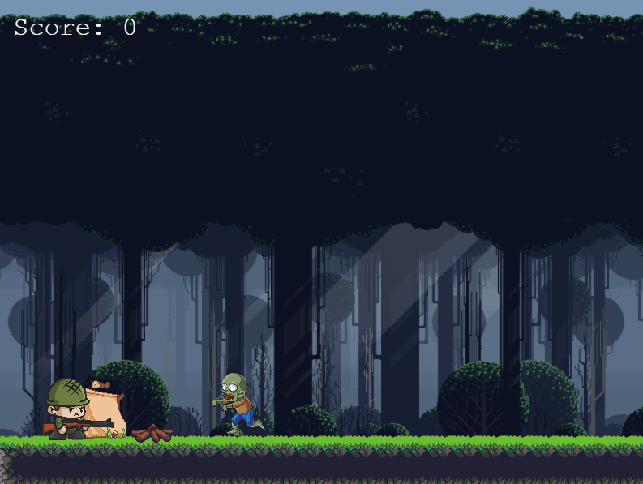
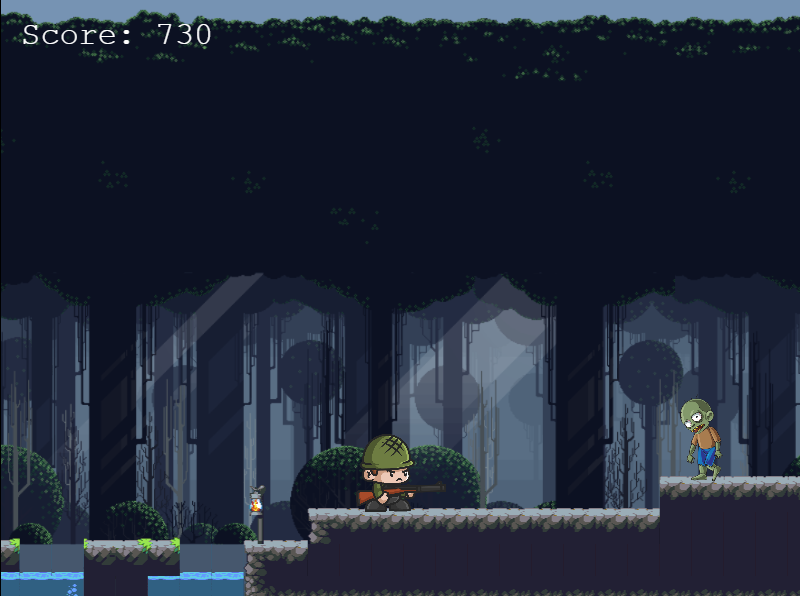
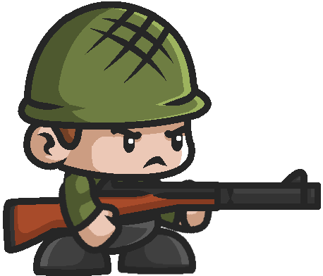

# ZOMBIE RAID
A JavaScript platform game built with Phaser 3.

## Table of Contents

* [Game Instructions](#game-instructions)
* [Live Demo](#demo)
* [Built With](#built-with)
* [Testing](#testing)
* [Design Credits](#design-credits)
* [Contributing](#contributing)
* [Acknowledgments](#acknowledgments)
* [Author](#author)
* [License](#license)

## Game Instructions

### Prerequisites

- Using NPM package and JavaScript knowledge to build and test the game.

### Installation

- Clone this repository into your account
- Run npm install to run all of the dependencies into your local repository
- Run the command 'npm start' to start the game running into your local machine.
- Finally, open [http://localhost:8080/](http://localhost:8080/) on your browser.

### Game Concept

Just another night in the jungle, Marlos hear something weird outside his tent, he takes a peek out and finds himself surrounded by a crowd of zombies. Fortunately, he is carrying his favorite rifle with him and a lot of rounds to blow their heads off. 

Do you think you've got what it takes to find a way out of the jungle with Marlos' rifle?

### Main Objective

Make a way through the zombies and survive.

### How to play

- To move Marlos you should use the 'left' and 'right' arrow keys on your keyboard.
- Jump by pressing the 'up' arrow on your keyboard.
- Shot by pressing the 'SPACE' key on your keyboard.
- Kill as many zombies as you can to increase your score.
- Avoid all the zombies to keep Marlos alive.

#### Marlos

- Marlos looks like he's just mad but he's actually trying to survive as well.

#### Enemies

- The way out the jungle is filled with zombies. Avoid them at all cost

## Demo

[Live Demo](https://zombieraid.netlify.app)

## Game Development Stages

- **Day 1 - 2**
**Learn Phaser 3 module**
 I code along the Phaser 3 platform game tutorial learning the basics about how to structure the project. I set up as well the current repo, installing Webpack and Phaser 3, thinking about the game logic. Manage to complete these steps without any problems.

- **Day 3 - 4**
**Game Design**
 Polish the game concept, define the characters and main objective. Look for assets to implement all of the game scenes. Define the game rules and logic. Plan the development of the game in specific chunks of user stories converted to technical tasks to be done. 
  - Game Concept 
  - Characters 
  - Main Objective 
  - Define Game Logic 
  - Implementation Plan 
  - Define Assets 

- **Day 5 - 6**
**Scene Development**
  - Implement main menu 
  - Implement part of the main game

- **Day 7 - 8**
**Game Development**
  - Learned tiled to implement a tilemap in the game.
  - Finished main game scene with tiled knowledge acquired.

- **Day 5**

**Game Development**
  - Implement GameOver scene
  - Add leaderboard API in the GameOver scene
**Deployment**
  - Run tests (Done)
  - Deploy to netlify (Done)

### Retrospective:

After developing the game and looking back at the initial plan, conceived on the second day these are some reflections about my development.

Overall, Phaser is a great framework but it takes some time to understand completely. Its documentation is confusing and not cohesive enough for first-timers. This meant a lot of time was invested in googling how to work around specific things, such as animations, tilemaps, and implementing forms. This was not easy at all and very time-consuming. The provided examples and tutorial didn't seem enough for those who just want to do something different than an endless speedrunner. 

My initial objective was to do my best to create my first game ever. Something that I would be proud of when I look back to it, to achieve this I was thinking about: 

- Implementing 2 Marlos stages: gun and sword.
- Implementing a custom tilemap.
- Making a challenging game implementing fake platforms.
- Implementing a final boss.
- Implementing random zombie spawn off cameras.
- Implementing a good-looking title menu.

I was only able to implement the first two even though I took more time than expected in making the game. I think my expectations were too high for the time given. 

## Built With
- Javascript
- HTML
- Phaser 3
- Webpack
- Tiled
- Babel
- Leaderboard API
- JEST testing
- Netlify
- ESlint and Stylelint as linters

## Testing

- Run tests by running: `npm test` on your CL.

## Contributing

Contributions, issues and feature requests are welcome!

You can do it on [issues page](issues/).

## Show your support

Give a ⭐️ if you like this project!

## Author

👤 Victor Gonzaelz
- Github: [@Shaqri](https://github.com/shaqri)
- Twitter: [@Victorgonbu1](https://twitter.com/victorgonbu1)
- LinkedIn :[VictorGonzalez](https://www.linkedin.com/in/victor-manuel-gonzalez-buitrago/)

## License

MIT standard license.

